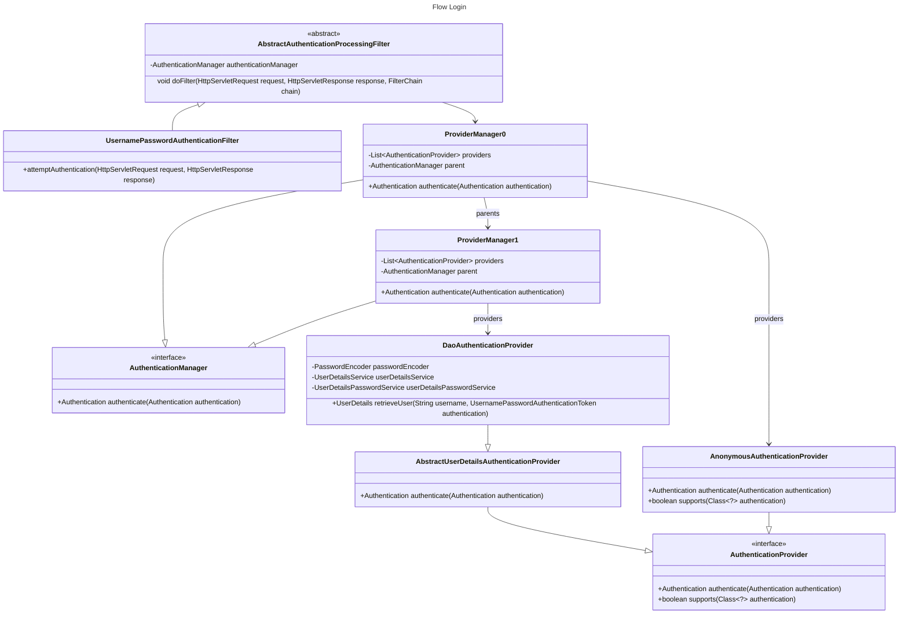

# oauth2-authorization-server

OAuth2 Authorization Server Skeleton

## 1. Flow Authorization Request

```
Send request to 
http://127.0.0.1:8080/oauth2/authorize?response_type=code
&client_id=ntnt-oidc-client
&redirect_url=https://oauth.pstmn.io/v1/callback
&state=kjh812kiugh123iblj
```


## 2. Flow login

After Login Authentication (UsernamePasswordAuthenticationToken) is stored into Session (Using sessionId to retrieve it)

## 4. Flow Authorization Request After request
Same flow as **1. Flow Authorization Request**, but now we have Authentication (UsernamePasswordAuthenticationToken) 
in Session
Then after authenticate it will redirect consent screen **5. Flow Authorization Consent**

## 5. Flow Authorization Consent

After finishing authorize consent, it will redirect to **6. Flow Client Authentication**

## 6. Flow Client Authentication & Token Response
### 6.1 Flow Client Authentication

After finishing this flow it will trigger **6.2 Flow Token Response** 

### 6.2 Flow Token Response

After finishing this flow, This server will return the access token and refresh token to the OAuth2 Client to use it 
to access the resource server or access to the user profile endpoint.

